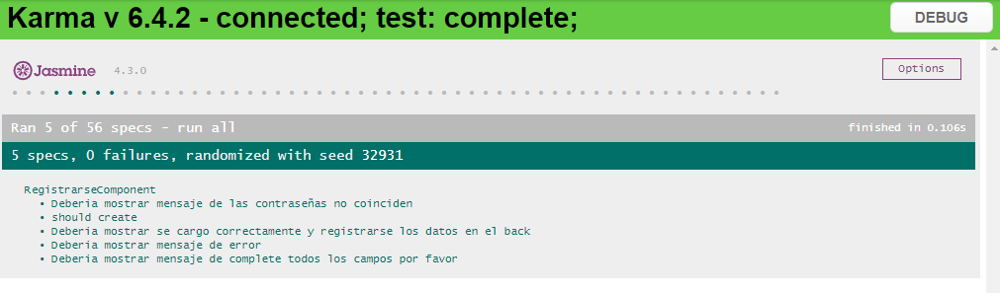
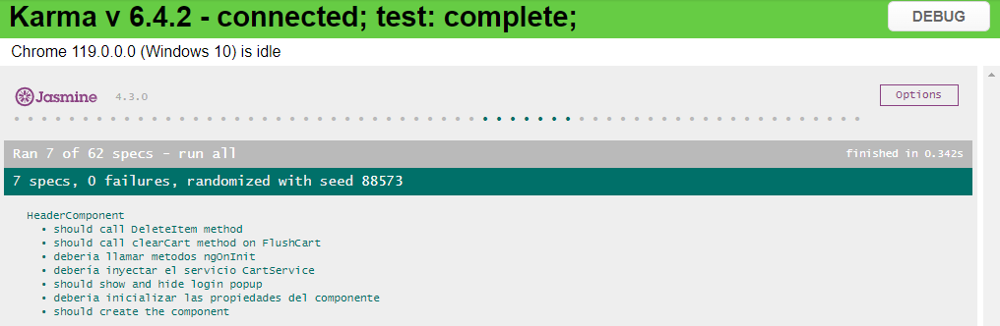
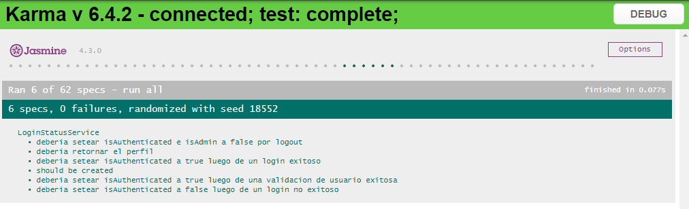

# El patrón del hard | Frontend

## Instalación 
### Pre-requisitos:

* NodeJS y NPM instalados en el dispositivo.
* Angular CLI instalado en el dispositivo ``` npm install -g @angular/cli ```

---

### Procedimiento de instalación:

1. Clonar el repositorio de frontend desde https://github.com/francobidart/dsw-tp-frontend
2. Ingresar al directorio de frontend y ejecutar el comando ``` npm install ```
3. Configurar los datos apiUrl en los archivos /src/environments/environment.ts y /src/environments/environment.prod.ts con la URL correspondiente al backend (agregar una barra **/** al final, ejemplo http://localhost:3000/).

### Ejecución de la aplicación

Para ejecutar la aplicación, luego de realizada la instalación de las dependencias y configurado la URL de API, ejecute el siguiente comando:

```
ng serve --open
```

Por defecto, y si el puerto se encuentra disponible, la aplicación se ejecutará en http://localhost:4200, en caso de no estar disponible se utilizará otro puerto.

### Consideraciones acerca de CORS y politicas de acceso

Es importante recordar que en caso de utilizar otro puerto deberá ajustar la url correspondiente en el backend para permitir el acceso desde el puerto correspondiente.

Para realizar este cambio, ingrese a la carpeta de backend y modifique las rutas disponibles en la variable _corsOptions_ dentro del archivo **app.js** ubicado en la carpeta raíz.

---

### Tests automáticos de frontend

Utilizamos las siguientes librerías para la definición de pruebas automatizadas
* Cypress
* Mocha
* Jasmine 

---

#### Prueba end-to-end (e2e)
Se incluye una prueba e2e que realiza las siguientes acciones para la creación de un pedido:

* Navegación a un determinado artículo.
* Selección de opción comprar ahora.
* Login de usuario con datos de prueba.
* Confirmación de la compra.


Para ejecutar la prueba se utilizan los datos iniciales disponibles en el backend, para ejecutar los tests realice el siguiente comando en la carpeta
raíz del proyecto frontend:

```
ng e2e
```

#### Imagen de verificación de resultados de la ejecución de las pruebas:


[Enlace a imagen completa](https://github.com/francobidart/dsw-tp-frontend/blob/main/docs/img/ejecucion_e2e_crear_pedido.png)

---

#### Prueba unitaria para el registro de usuarios
Se incluye una prueba unitaria para el componente de registro de usuarios, que incluye la validación del formulario, la 
prueba de los respectivos mensajes de validación así como también la validación de los toasts de confirmación, los casos definidos son:

* Mostrar mensaje de error si las contraseñas no coinciden.
* Mostrar mensaje de error en caso de que falten datos obligatorios.
* Realizar el registro de un usuario, mostrando el mensaje de confirmación.
* Mostrar un mensaje de error general en caso de que haya algún problema en el registro.

Para ejecutar la prueba se deberá ejecutar el comando:

```
ng test
```

La prueba incluida se correponde a **RegistrarseComponent**

#### Imagen de verificación de resultados de la ejecución de la prueba:



[Enlace a imagen completa](https://github.com/francobidart/dsw-tp-frontend/blob/main/docs/img/ejecucion_unit_registrarse_component.png)

---

#### Prueba unitaria para la creación del componente header
Se incluye una prueba unitaria para el componente de header, que incluye la creación, validación del servicio de carrito y sus funciones y show/hide de login.
Para ejecutar la prueba se deberá ejecutar el comando:

```
ng test
```

La prueba incluida se correponde a **HeaderComponent**

#### Imagen de verificación de resultados de la ejecución de la prueba:



[Enlace a imagen completa](https://github.com/francobidart/dsw-tp-frontend/blob/main/docs/img/ejecucion_unit_header_component.png)


---

#### Prueba unitaria del servicio de login status
Se incluye una prueba unitaria para el servicio de login status, comprende:

* Validar login exitoso, asignando los correspondientes valores al estado de login.
* Validar login erroneo, validando que se muestren los mensajes correspondientes.
* Retornar el perfil del usuario.

Para ejecutar la prueba se deberá ejecutar el comando:

```
ng test
```

La prueba incluida se correponde a **LoginStatusService**

#### Imagen de verificación de resultados de la ejecución de la prueba:



[Enlace a imagen completa](https://github.com/francobidart/dsw-tp-frontend/blob/main/docs/img/ejecucion_unit_login_service.png)


---

### Demostración en video del funcionamiento de la plataforma

[](https://www.youtube.com/watch?v=XbLrnse9iSo "Demostración en video")

[Enlace a video completo](https://www.youtube.com/watch?v=XbLrnse9iSo)
