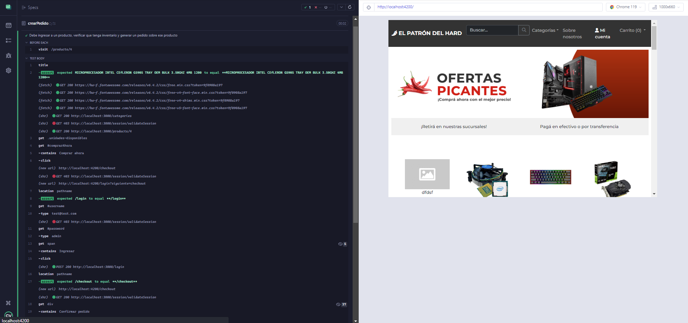

# El patrón del hard | Frontend

## Instalación 
### Pre-requisitos:

* NodeJS y NPM instalados en el dispositivo.
* Angular CLI instalado en el dispositivo ``` npm install -g @angular/cli ```

---

### Procedimiento de instalación:

1. Clonar el repositorio de frontend desde https://github.com/francobidart/dsw-tp-frontend
2. Ingresar al directorio de frontend y ejecutar el comando ``` npm install ```
3. Configurar los datos apiUrl en los archivos /src/environments/environment.ts y /src/environments/environment.prod.ts con la URL correspondiente al backend (agregar una barra **/** al final, ejemplo http://localhost:3000/).

### Ejecución de la aplicación

Para ejecutar la aplicación, luego de realizada la instalación de las dependencias y configurado la URL de API, ejecute el siguiente comando:

```
ng serve --open
```

Por defecto, y si el puerto se encuentra disponible, la aplicación se ejecutará en http://localhost:4200, en caso de no estar disponible se utilizará otro puerto.

### Consideraciones acerca de CORS y politicas de acceso

Es importante recordar que en caso de utilizar otro puerto deberá ajustar la url correspondiente en el backend para permitir el acceso desde el puerto correspondiente.

Para realizar este cambio, ingrese a la carpeta de backend y modifique las rutas disponibles en la variable _corsOptions_ dentro del archivo **app.js** ubicado en la carpeta raíz.

---

### Tests automáticos de frontend

Utilizamos las siguientes librerías para la definición de pruebas automatizadas
* Cypress
* Mocha

Se incluye una prueba e2e que realiza las siguientes acciones para la creación de un pedido:

* Navegación a un determinado artículo.
* Selección de opción comprar ahora.
* Login de usuario con datos de prueba.
* Confirmación de la compra.


Para ejecutar la prueba se utilizan los datos iniciales disponibles en el backend, para ejecutar los tests realice el siguiente comando en la carpeta
raíz del proyecto frontend:

```
ng e2e
```

#### Imagen de verificación de resultados de la ejecución de las pruebas:



[Enlace a imagen completa](LINK)
